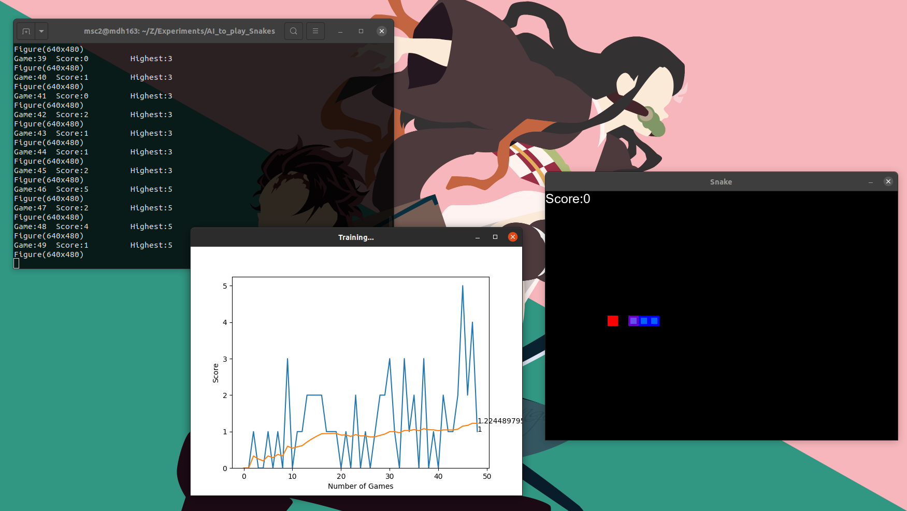
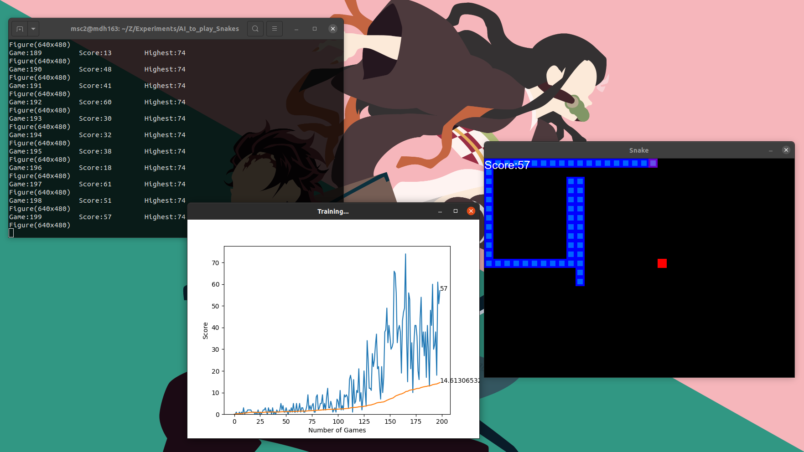

# AI_to_play_Snakes

The code builds a neural network that learns to play classic Snakes game using Reinforcement Learning(Q-Learning) and saves the highest-scoring model in `./model` folder. The game environment is also built from scratch using pygame.  

For this project I referred Patrick Loeber's repository:  
https://github.com/patrickloeber/snake-ai-pytorch  
and video tutorials can be found at:  
Author's personal playlist:  
https://www.youtube.com/playlist?list=PLqnslRFeH2UrDh7vUmJ60YrmWd64mTTKV
Merged version at freeCodeCamp channel:  
https://www.youtube.com/watch?v=L8ypSXwyBds  

Though this repository though has similarity to original one, it has considerable change in high level overview and implementation logic.  

The problem of colliding into its own body is still present. Here I tried to mitigate that issue by providing the relative direction of tail block and mid-bock(of the body) as states to the snake.

----
# Shots



# Gameplays


https://user-images.githubusercontent.com/78490078/224676430-233b1600-d0c7-4214-8574-24e0ecf2ffed.mp4


https://user-images.githubusercontent.com/78490078/224676124-7bc84294-88e6-44dc-822f-898ac05cf0d5.mp4


----
# Libraries used
1. PyTorch `torch`: To build the neural network model and its trainer.
2. `pygame`: To build the snake game environment.
3. `ipython`: To plot the training scores, to create the display window.
4. `matplotlib`: To plot the training scores, on the created window.
7. `numpy`

----
# The files and folders
```
./
|---Agent.py     [The main controller]
|
|---SnakeGame.py [Game-Environment and the Snake-body]
|
|---Mind.py      [The Neural Network mind of Snake. Also contains the trainer.]
|
|---helper.py    [GLOBAL_CONSTANTS, helper classes, plot function]
|
|---model/       [Trained models are saved here.]
|
|---arial.ttf    [For pygame font.]
|
|---requirements.txt [The packages used]
|
|---requirements_with_versions_used.txt
```

----
# To Run

### Install required libraries
`pip install -r requirements.txt`  
If incompatability in installed libraries arises, use below to use the libraries with versions used during development:  
`pip install -r requirements_with_versions_used.txt`  

### Run
```python3 Agent.py```  
By default a trained model is loaded and used. Comment the loading of pretrained model in `__main__` block of `Agent.py` to avoid this.

# Human controlled Game
You can run following to play the game by manual control:  
`python3 Snake_Game.py`  
If speed is too fast, you can decrease it: `SPEED` variable in `helper.py`. 20 is recommended.  
Remember direction is taken with relative to snake's current direction.  
| Arrow Keys | Direction |
|--|--|
| LEFT | Left |
| UP | Front |
| RIGHT | Right |
| DOWN | No such thing. |

----
# The model
It is a very simple model with following layers:  
| Layer No | Type | In-Feature | Out-Feature | Learnable Parameters |
|----------|------|------------|-------------|-----------------|
| 1        |Linear|  11        | 512         | 6144 |
|          | LeakyReLU | 512   | 512 | - |
| 2       | Linear | 512       | 3 | 1539 |
| | | | Total: | 7683 |


----
# High Level Workflow

## Agent
1. Has Mind model.
2. Has QTrainer to train above model.
3. During training: Initializes a SnakeGame()
	1. Get current_state of Game.
	2. Pass this old_state to Mind and get new_move from Mind.
	3. Pass new_move to Game and get reward, game_over, score.
	4. Get new_state from Game; Since a move has been made.
	5. Pass (old_state, new_move, reward, new_state, game_over) to QTrainer which trains the model.
	6. Also save these data in memory.
	7. If game_over
		1. Make the batches of everything in memory.
		2. Pass to QTrainer which will train the model on these whole data again. (Memory Relay Concept)
	8. Continue loop forever.

## SnakeGame
1. Creates the environment: Screen, snake, places food, resets scores,etc.
2. Creates a Snake inside it.
3. Allows to make move of Snake via it.

## Mind
1. A simple Neural-Network.
2. Predicts next action(Actually Q-value:Expected future reward associated with each possible action from current state) and also takes epsilon(chance of random move).

## QTrainer
1. Takes a Mind() model.
2. Given states, actions, etc... trains the model using Q-Learning(uses Bellman Equation)

